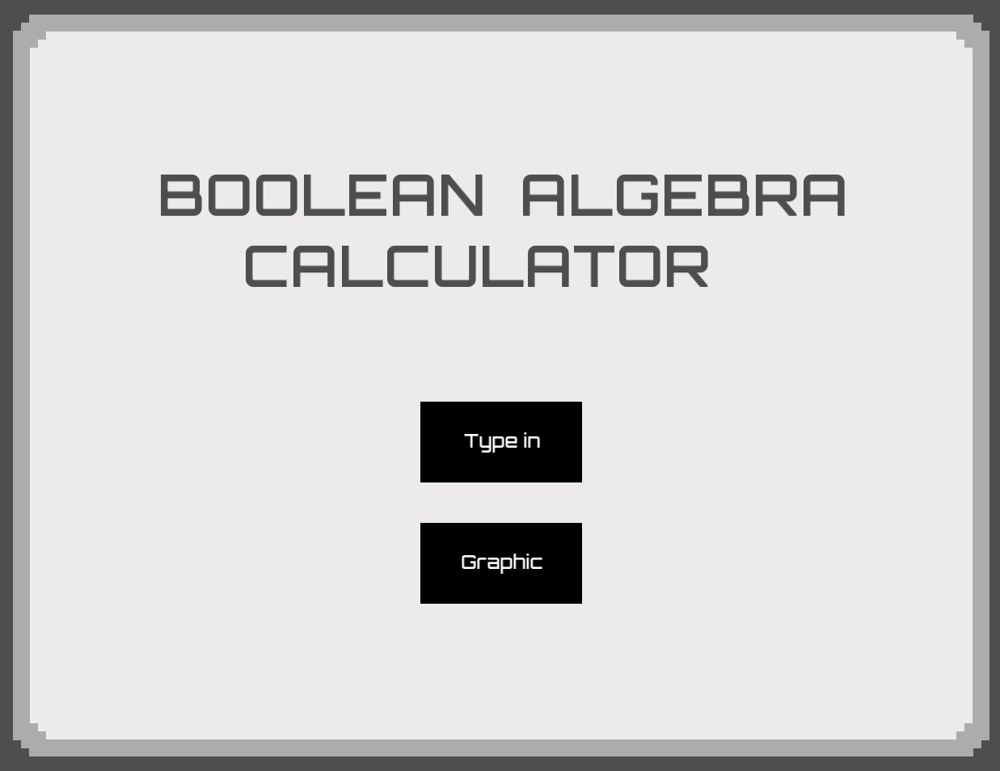

# Boolean-Algebra-Calculator
This is a project my fellow peers and I built to help student approach the seemingly boring subject of boolean algebra by implementing colorful and interactive GUI. 

## Instructions
Access the `BoolCalculator.exe` in the build folder to run the program.

PLEASE DO NOT MOVE FILE LOCATIONS or the program cannot find its resource directories and crashes
or in some cases the computer misleads it as a virus file which it is not. 

The `BoolCalculator.exe` is built using Makefile in VSCode
Folders:
- assets:     all `.png` files used in the program
- build:      the `.exe` file, Makefile and some SFML `.dll` (dynamically linked library) files
- font:       all font `.ttf` (true type font) files
- include:    all header files including SFML headers
- lib:        all SFML library files
- src:        all `.cpp` files

### Features
- Use Type-in to manually type in your boolean equation.
- Use Graphic to construct the boolean equation by fundamental blocks and connections.
The program can then simplify the equation in the form of sum of product (SOP).

.png "Title")
